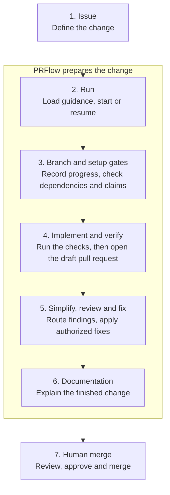

Follow a PRFlow request through seven stages, from issue preparation to human merge. PRFlow performs the middle stages. The merge stays with a person.



<Steps>
  <Step title="Issue">
    The GitHub issue is the contract for the change. PRFlow reads its description and its acceptance criteria.

    The optional [create-issue workflow](/docs/workflows/create-issue) clarifies unresolved decisions and waits for explicit approval before it creates the issue.
  </Step>

  <Step title="Run">
    An implementation command starts the run.

    ```text
    /prflow:implement 123
    ```

    PRFlow loads repository guidance and configuration, then creates or resumes the workpad on issue 123.

    A local run can ask you questions. A cloud run works from the issue and the recorded workpad, because no person is present in the session.
  </Step>

  <Step title="Branch and Setup Gates">
    PRFlow creates, reuses or adopts a feature branch, pushes it and records it in the workpad. The workpad mirrors the issue's acceptance criteria and tracks the run's status. See [Workpads and Resume](/docs/concepts/workpads-and-resume).

    Three gates can stop the run here, before any code is written:

    - **A declared open dependency.** If the issue declares a dependency on another issue that is still open, or if the state of that dependency cannot be established, the run stops as `Blocked`. This check runs before branch work, so a blocked run leaves no new branch behind.
    - **A claim in the issue that does not match the repository.** PRFlow checks the issue's claims about the codebase against the current tree before it treats them as instructions. It also checks that the acceptance criteria represent every independently testable outcome the issue describes. An uncovered outcome sends the issue back for refinement instead of being guessed at.
    - **A workpad already marked `Blocked`.** PRFlow surfaces the recorded cause instead of continuing through it.
  </Step>

  <Step title="Implement and Verify">
    PRFlow explores the affected code, plans the change and implements it.

    For an issue classified as a bug report, reproduction is a hard gate. PRFlow captures a reproduction signal, such as a failing test or an error log, **before** it plans the fix. If it cannot reproduce the defect, the run stops as `Blocked` and records why. It does not proceed on an unreproduced bug.

    PRFlow then runs the repository's own checks in the run environment, commits and pushes the work and opens a draft pull request that closes the issue. The checks run before the draft pull request is opened, not after it. See [How PRFlow Verifies a Change](/docs/concepts/verification).

    The pull request stays a draft while the remaining review and documentation work happens.
  </Step>

  <Step title="Simplify, Review and Fix">
    First PRFlow runs a **simplification pass** over the code the change added or modified. Its charter is quality only: reuse, simplification, efficiency and altitude. It does not hunt for bugs and it never owns correctness. Every finding it produces is checked against the issue's acceptance criteria before it is applied, so a cleanup cannot quietly undo something the issue required.

    Then the review-and-fix loop runs. The review engine builds a verification checklist, checks it against evidence and dispatches specialized reviewers. Findings can trigger corrections and another review iteration. See [The Review System](/docs/concepts/review-system).

    Before the run can finish, every in-scope acceptance criterion must be verified, or explicitly routed to a follow-up issue or to post-merge verification.

    <Warning>
      This gate checks the criteria the issue actually lists. An issue with **no** acceptance criteria gives the gate nothing to check, so it passes without verifying anything against the issue. Write acceptance criteria if you want this gate to mean something.
    </Warning>
  </Step>

  <Step title="Documentation">
    PRFlow files follow-up issues for deferred work, updates the internal and external documentation the change affects, adds release-note material when it is needed and refreshes the pull-request description.

    By default the pull request is then published as ready for review. Repository configuration can leave it as a draft instead.
  </Step>

  <Step title="Human Merge">
    A person reviews the pull request, the repository's own checks, the workpad and the review findings. Branch protection and your team's normal approval process still apply.

    PRFlow never performs the merge. The lifecycle ends with a review-ready or deliberately draft pull request, not with code on the default branch.
  </Step>
</Steps>

## Where a Run Can Stop

A run that cannot proceed stops and records the reason instead of guessing. The common terminal causes are an open declared dependency, a bug it could not reproduce, an acceptance criterion it could not verify, a verification command it is not permitted to run and an unresolved critical review finding.

<Tip>
  A `Blocked` result is information, not a failure of the tool. Read the recorded cause on the workpad, resolve it and run the command again.
</Tip>

## Related Documentation

- [Workpads and Resume](/docs/concepts/workpads-and-resume)
- [How PRFlow Verifies a Change](/docs/concepts/verification)
- [The Review System](/docs/concepts/review-system)
- [Human Control](/docs/concepts/human-control)
