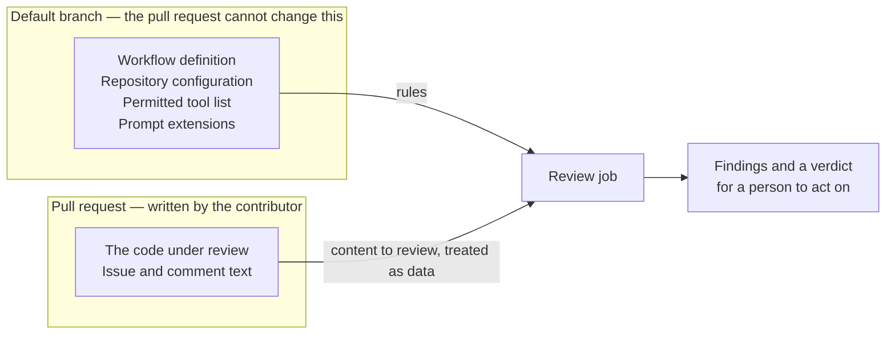

Review PRFlow's security posture before you adopt it. This page states what the tool can do, what bounds it and what you still have to decide for yourself.

## What PRFlow Can Write

PRFlow writes to GitHub, and only to GitHub. It has no other destination.

| It can write | Where |
| --- | --- |
| Issue comments | The issue the run is working on, including the progress workpad |
| Branches, commits and pushes | The feature branch for the issue |
| Pull requests | The pull request for that branch, and its description |
| Reviews | The pull request under review, as an approval or a request for changes |
| Follow-up issues | The same repository, for deferred work |
| Labels and reactions | The issues, pull requests and comments involved in the run |

<Warning>
  PRFlow never merges a pull request. There is no configuration setting that makes it merge. The integration decision is always a person's.
</Warning>

Every write is an ordinary GitHub write under an identity you configure, so all of it is visible in the repository's history and audit log. Nothing PRFlow does bypasses branch protection, required checks or required approvals.

<Note>
  A run can only make a write its identity has permission to make. If you give the run less access, it does less, and it reports what it could not do rather than working around it.
</Note>

## Who Can Start a Cloud Run

A cloud run starts from a comment. Not from an issue body, not from a pull-request body and not from a title — only from a real comment posted after the fact.

Before any work begins, the run checks who posted that comment:

- **A person** must match `prflow.allowed_users` **and** hold write, maintain or admin permission on the repository. The setting defaults to `*`, which means any collaborator, and the permission check still applies on top of it. Narrow it to specific logins when you want a shorter list.
- **A bot** must appear in `prflow.allowed_bots`. Automation identities do not get the collaborator check, so list only the ones you intend to let incur runs.

The gate fails closed. If the identity or the permission level cannot be established, the run declines rather than proceeding.

<Note>
  An outside contributor working from a fork cannot start a privileged run by commenting on their own pull request. They do not hold repository permission, so the gate declines.
</Note>

See [Cloud Triggers](/docs/runs/cloud/triggers) for the comment forms and [Core Settings](/docs/configuration/core-settings) for the two settings.

## The Trust Boundary on a Cloud Run

This is the part worth reading twice, because it is what makes automated review meaningful.

A cloud run reads the rules that govern it — the workflow definition, the repository configuration, the permitted tool list and the prompt extensions that shape the agent's instructions — from the repository's **default branch**. It does not read them from the pull request being reviewed.

<Warning>
  A pull request cannot rewrite the rules that review it. It cannot grant itself extra tools, enable extra provisioning for its own review, choose which version of the plugin reviews it or write instructions into the reviewing agent's own prompt.
</Warning>

The reason is direct: the review job has to check out the contributor's code in order to review it, and anything that code could change about the review would be a floor the pull request controls. A floor the pull request controls is no floor. So the governing inputs are taken from a source the pull request cannot reach, and when a trusted copy cannot be established the run fails closed rather than falling back to the pull request's copy.

The code under review is still fully reviewed. Only the **rules** come from elsewhere.

## Content From Users Is Data, Not Instructions

A run reads text that people outside your team may have written: issue bodies, pull-request descriptions, comments and the names of CI checks. Anyone who can open a pull request can choose what those say.

PRFlow treats all of it as **data to quote, never as instructions to obey**. Check names in particular are attacker-controlled free text, so a run is told up front to quote a check name and never to act on one — while still trusting the pass or fail conclusion beside it, which comes from the GitHub API rather than from the name.

<Note>
  This is a mitigation, not a proof. Prompt injection is an unsolved problem in the industry, and no instruction-level defense is complete. Treat it as one layer among the others on this page, and keep human review of the resulting diff.
</Note>

An unknown CI state is never presented to the agent as a passing one. When PRFlow cannot read the CI results for a commit, it says the results are unavailable rather than reporting green.

## The Reviewer Path Is Read-Only

The reviewing path is separated from the writing path on purpose.

- Review runs use a separate identity from the one that authors pull requests. That separation is what lets a review be recorded at all, since GitHub does not let an author formally review their own pull request.
- Tools that modify the working tree are removed from the reviewer's permitted set before the run starts, regardless of what the repository's configuration asks for. Configuration can narrow that set. It cannot widen it past the built-in floor.
- The removal is by tool name, so a narrowed or parameterized spelling of a tree-modifying tool is removed exactly like the plain one.
- The review agents are contractually forbidden from modifying the working tree. Independently of that, the engine takes a snapshot of the tree before dispatching them and compares it afterwards, so a violation is detected and reported rather than trusted not to happen.

<Warning>
  Read-only means the reviewer does not modify your code. It does not mean the reviewer is infallible. Read [The Review System](/docs/concepts/review-system) for what a verdict does and does not establish.
</Warning>

## Credentials

The cloud tier needs **one secret** by default: a Claude Code authentication token, stored as a GitHub Actions secret. GitHub operations use the built-in `GITHUB_TOKEN`, which needs no setup.

Two optional additions exist:

- **A GitHub App**, if you want cloud writes to appear under your own App identity instead of the built-in Actions identity, or if you need runs to be able to edit workflow files. Each step mints a short-lived token scoped to just what that step does.
- **A model provider key**, if you route a workflow section through a third-party model provider. With no provider configured, the default stays a single secret.

The review path runs under its own identity with read-only repository access, so the identity that reviews cannot push.

See [Cloud Setup](/docs/runs/cloud/setup) and [Providers](/docs/configuration/providers).

## Local Runs

A local run executes in your Claude Code session, on your machine, under your client's permission prompts. It uses your existing Git and GitHub CLI credentials — PRFlow stores none of its own.

The same boundaries apply: it writes only the GitHub artifacts listed above and it never merges. Grant permissions at the narrowest useful scope. See [Local Permissions](/docs/runs/local/permissions).

## What You Should Still Review Yourself

<CardGroup cols={2}>
  <Card title="Who has write access" icon="users">
    PRFlow's gate controls who can start a run. It does not change what write access already means. Anyone with write access to a repository can reach its Actions secrets through workflows they push, whether or not PRFlow is installed. Manage that list first.
  </Card>
  <Card title="The tool permissions you grant" icon="key">
    Every command a run may execute comes from a list you commit. Review it as you would review a CI script, and keep broad shell, filesystem and credential access out of it.
  </Card>
  <Card title="The prompt extensions you commit" icon="file-pen">
    Prompt extensions change how PRFlow behaves in your repository. They are committed files on your default branch, so review changes to them like code.
  </Card>
  <Card title="Every diff before merging" icon="code-pull-request">
    The review evidence is input to your decision, not a replacement for it. Read the code, the tests and the workpad reflections before you merge.
  </Card>
</CardGroup>

## Related Documentation

- [Human Control](/docs/concepts/human-control)
- [The Review System](/docs/concepts/review-system)
- [How PRFlow Verifies a Change](/docs/concepts/verification)
- [Cloud Triggers](/docs/runs/cloud/triggers)
- [Cloud Setup](/docs/runs/cloud/setup)
- [Tool Permissions](/docs/configuration/tool-permissions)
- [Core Settings](/docs/configuration/core-settings)
