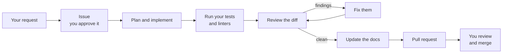

PRFlow is a [Claude Code](https://code.claude.com) plugin that takes one request and hands back a pull request that is ready for your review.

Not a snippet. Not a first draft. A branch with the code, the tests the change needed, the documentation it affected, a record of what was verified and a review that already found and fixed its own problems. You do the final review and the merge.

## The Problem PRFlow Solves

Coding agents are impressive on a fresh repository and disappointing on a real ticket.

Point one at a change in a large production codebase and it usually comes back with part of the work: code that ignores an existing pattern, no tests, documentation left stale and acceptance criteria that were never checked. The agent saved you an hour of typing and cost you two hours of review and cleanup.

The bottleneck moved. Writing code got cheap. Everything around it — planning against architecture that already exists, verifying the change, reviewing it seriously, keeping documentation true — did not. That is the work PRFlow does.

## What You Actually Get

| | A raw coding agent | PRFlow |
| --- | --- | --- |
| **Starting point** | A prompt | A GitHub issue with acceptance criteria |
| **Scope** | What fits in one response | A whole ticket, across as many steps as it takes |
| **Tests** | If you ask | Written and run as part of the change |
| **Review** | You do it | Independent review passes that find issues and fix them, then re-review |
| **Documentation** | Rarely | Internal docs, public docs and release notes updated in the same run |
| **Evidence** | The chat log | A progress record on the issue naming what was verified and what was not |
| **Result** | A diff to clean up | A pull request to review and merge |

## How It Works

Three commands cover the common path.

<Steps>
  <Step title="Describe the work">
    `/prflow:create-issue` turns a rough idea into a GitHub issue. It reads your repository first, asks the questions it genuinely cannot answer and creates nothing until you approve the exact draft.
  </Step>
  <Step title="Let PRFlow build it">
    `/prflow:implement 123` creates a branch, plans the change against your existing code, implements it, runs your tests, reviews the diff, fixes what the review found, updates the documentation and opens a pull request. It writes its progress to a comment on the issue as it goes, so you can watch or walk away.
  </Step>
  <Step title="Review and merge">
    You read the pull request. PRFlow never merges it. Your branch protection and your normal approval process are untouched.
  </Step>
</Steps>

A run on a real ticket takes minutes, not seconds. It is doing the whole round, not a single completion.

## What Makes the Review Trustworthy

Any single pass from a language model is variable. PRFlow is built around not trusting one.

<CardGroup cols={2}>
  <Card title="Independent reviewers" icon="users">
    Several reviewers with different jobs look at the same change without seeing each other's conclusions. When more than one raises the same defect, that agreement counts for something.
  </Card>
  <Card title="Verification before opinion" icon="list-check">
    PRFlow builds a checklist of the specific claims a change makes and checks them against the code. A check that fails, or that cannot be settled, blocks a clean approval.
  </Card>
  <Card title="A review of the review" icon="eye">
    Before an approval stands, a separate pass re-examines the change without the first review's conclusions, looking for what it missed.
  </Card>
  <Card title="It improves itself" icon="arrows-rotate">
    A weekly retrospective reads PRFlow's own track record and proposes the smallest change that would prevent a repeating mistake. A person approves or rejects each one.
  </Card>
</CardGroup>

## What PRFlow Does Not Do

Honesty here is worth more than a stronger claim.

- **It does not merge.** PRFlow prepares a pull request. Every merge decision stays with a person and with your repository's protections.
- **A clean review is evidence, not proof.** The extra review passes narrow the chance of a bad change getting through. They never close it. Reviewers can share the same blind spot, and a test can encode the same wrong assumption as the code it covers.
- **It does not invent your requirements.** If an issue leaves a decision open, PRFlow stops and asks rather than guessing. A run can end Blocked, which is a result, not a failure.
- **It does not run without permission.** Locally it uses your session's tools and permission prompts. In the cloud it runs only when an authorized person asks it to.

## Start Here

<CardGroup cols={2}>
  <Card title="Quickstart" icon="bolt" href="/docs/quickstart">
    Install PRFlow and get your first pull request on one page.
  </Card>
  <Card title="Getting Started" icon="book-open" href="/docs/getting-started/index">
    Requirements, installation, repository setup and a guided first run.
  </Card>
  <Card title="Workflows" icon="route" href="/docs/workflows/index">
    Every command, what it changes and when to reach for it.
  </Card>
  <Card title="How PRFlow Works" icon="diagram-project" href="/docs/concepts/index">
    The lifecycle, the review system, verification and the security boundaries.
  </Card>
</CardGroup>

## Getting Help

When something goes wrong, start from the symptom in [Troubleshooting](/docs/troubleshooting/index).

When reporting a problem, include your PRFlow version, your operating system, the command you ran, whether it was a local or a cloud run and the smallest excerpt of the error. Remove credentials and private repository content before sharing any log.
