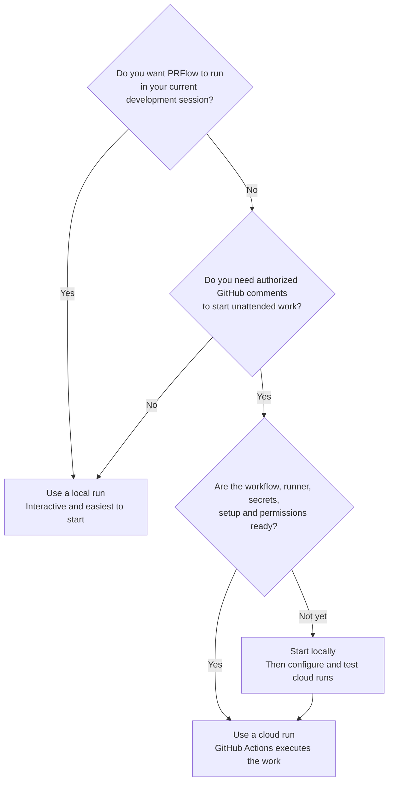

Decide where PRFlow does the work: inside your own Claude Code session, or inside GitHub Actions after an authorized comment.

Both modes run the same workflows. They differ in who starts a run, which credentials it uses and how you approve what it does.

## Compare the Two Modes

| **Run Type** | **Where It Runs** | **How It Starts** | **Best For** |
| --- | --- | --- | --- |
| [Local runs](/docs/runs/local/index) | Your Claude Code session on your own machine. | You type a `/prflow:` command. | First use, interactive decisions and access to a development environment you already trust. |
| [Cloud runs](/docs/runs/cloud/index) | GitHub Actions, using repository secrets and variables. | An authorized person comments on an issue or a pull request. | Hands-off work started from GitHub, with credentials the repository owns. |

Local runs inherit tools, authentication and permission prompts from your Claude Code session. They need no GitHub Actions workflow and no repository secret.

Cloud runs use committed workflow files, explicit GitHub permissions, repository secrets and a declared setup process. They need more maintenance than the local path.

<Note>
  PRFlow's documented command syntax describes Claude Code. The plugin has also been verified to work in GitHub Copilot CLI, Codex CLI, Codex Desktop and VS Code agent modes, but each of those clients names and invokes plugin commands its own way. Follow that client's own documentation for the exact prefix.
</Note>

## What Each Mode Supports

A local install exposes every public PRFlow workflow, including the ones that never run in the cloud: issue authoring, repository initialization, the documentation family and the weekly retrospective.

A fresh cloud install ships two workflow files and answers four comment commands:

| **Comment Command** | **Where You Post It** |
| --- | --- |
| `/prflow:implement 123` | A comment on the issue itself. |
| `/prflow:review` | A comment on a pull request's **Conversation** tab. |
| `/prflow:review-and-fix` | A comment on a pull request's **Conversation** tab. |
| `/prflow:pr-description` | A comment on a pull request's **Conversation** tab. |

Automatic pull-request-triggered review is not part of a fresh install. If you want a review requested without anyone typing a comment, see [Request a Review Automatically on Green CI](/docs/runs/cloud/auto-review).

<Warning>
  No PRFlow run merges a pull request. Every mode ends with a branch, a pull request, a workpad or a review for a person to read and act on.
</Warning>

## Start Here

<CardGroup cols={2}>
  <Card title="Local Runs" icon="terminal" href="/docs/runs/local/index">
    Run PRFlow from a Claude Code session in your own checkout.
  </Card>
  <Card title="Cloud Runs" icon="cloud" href="/docs/runs/cloud/index">
    Let authorized collaborators start PRFlow from a GitHub comment.
  </Card>
  <Card title="Commands and Arguments" icon="keyboard" href="/docs/runs/local/client-commands">
    The command syntax, the arguments each workflow accepts and which ones are local-only.
  </Card>
  <Card title="Cloud Triggers" icon="comment" href="/docs/runs/cloud/triggers">
    The exact comment format, the surface each command works on and who may fire it.
  </Card>
</CardGroup>

Begin locally. Add cloud automation once you understand the workflows, the verification commands and the permission scopes they need.
